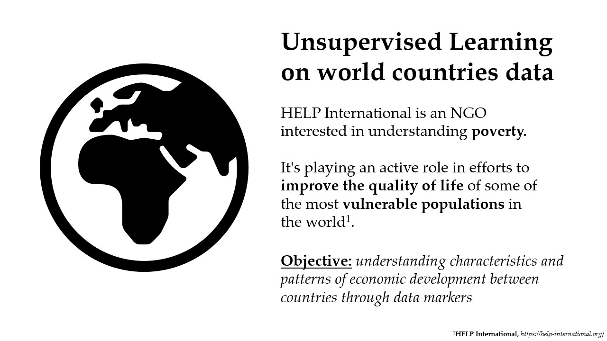
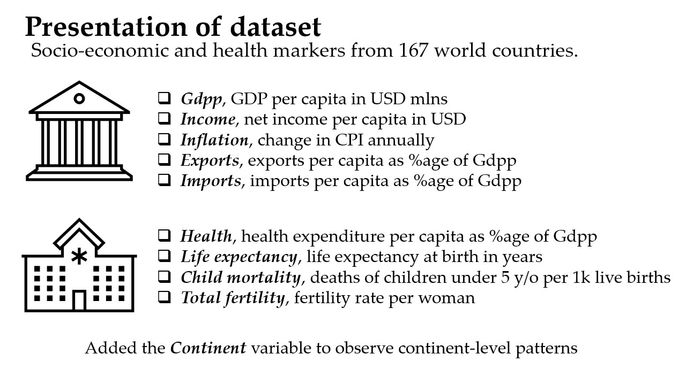
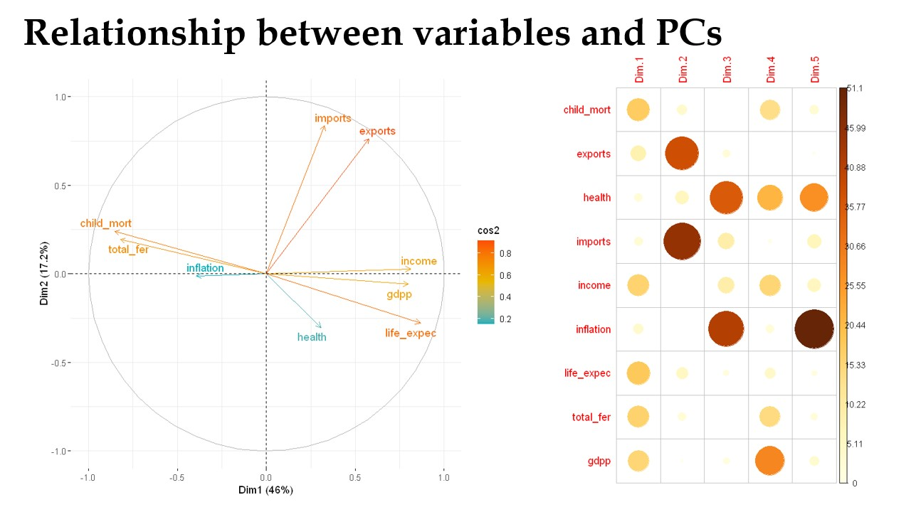
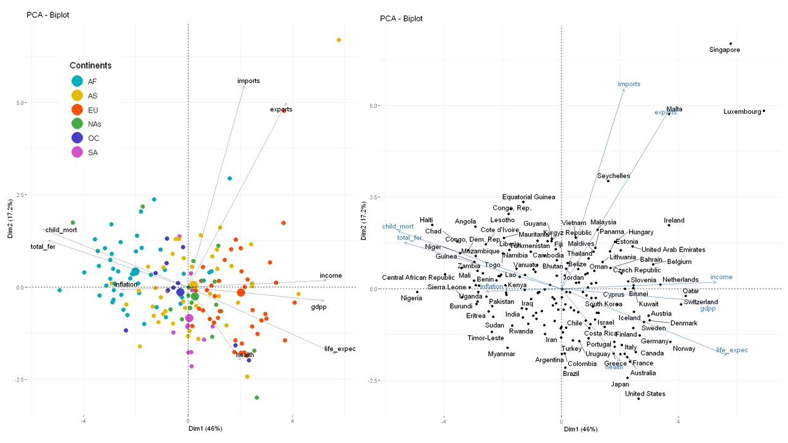
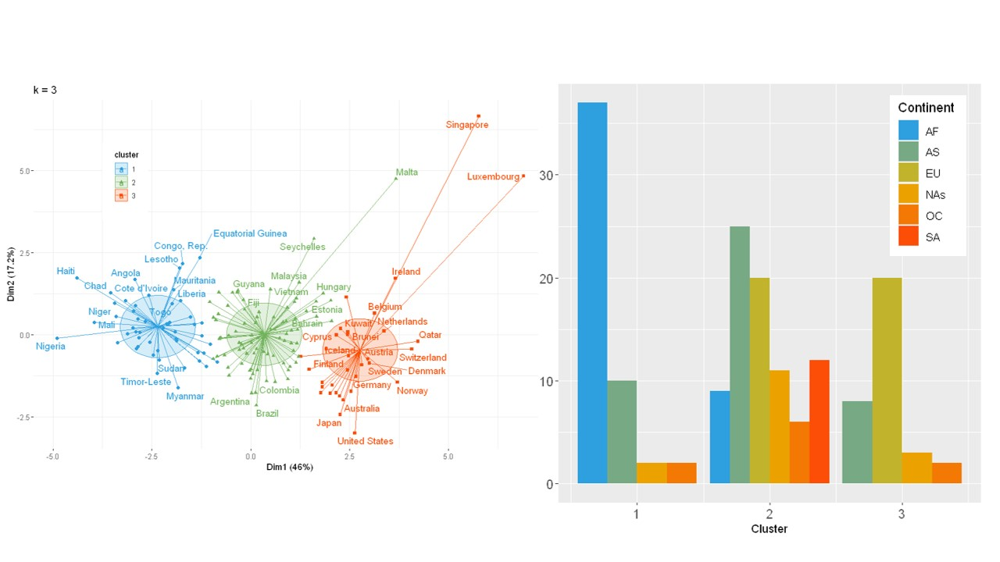
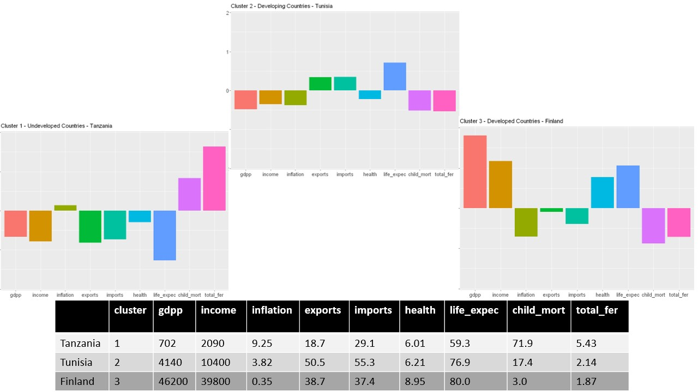
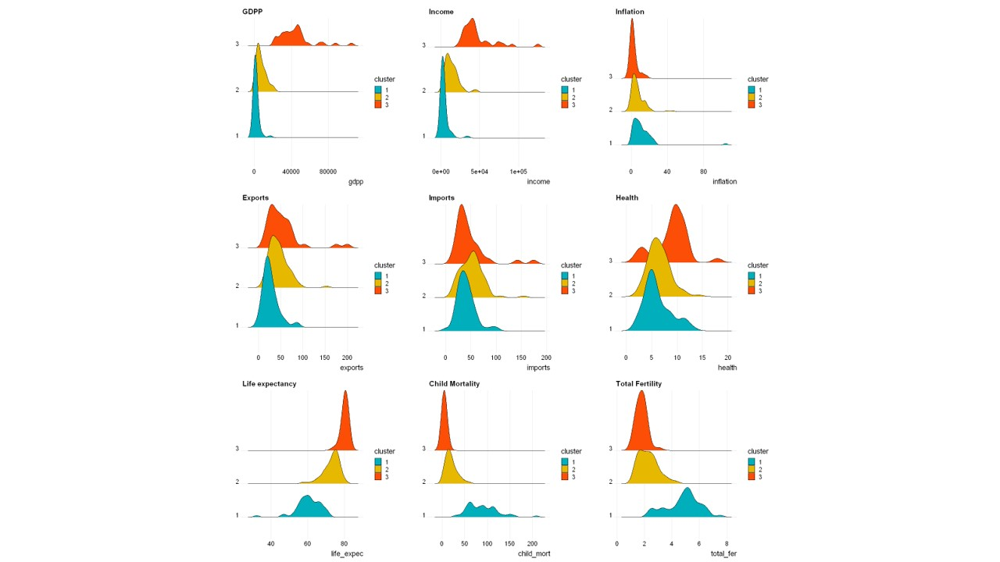

## Nation developement analysis
This repository hosts an analysis performed on a dataset created by HELP International on living conditions and development factors in 167 countries of the world.

The objective of the analysis was using unsupervised machine learnins methods such as PCA, k-means and k-medoids on socio-economic markers (GDP per capita, inflation, life expectancy, child mortality and so on) to understand the distribution of those countries on the plane created by those features and infer their development.

A comprehensive report on the results of the analysis can be found in [report.pdf](report.pdf).

### Presentation preview
Following are some slides taken from the powerpoint presentation used to present the study keypoints.

